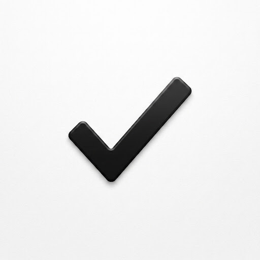

<div align="center">

  

  # Simple Todo

  **A modern, minimal task management application built with Flutter & Clean Architecture.**

  [](https://flutter.dev)
  [](https://dart.dev)
  [](https://www.android.com)
  [](https://pub.dev/packages/flutter_bloc)
  [](https://blog.cleancoder.com/uncle-bob/2012/08/13/the-clean-architecture.html)
  [](LICENSE)

</div>

---

## 🌟 Overview

**Simple Todo** is a clean, modern task management application built with a focus on high-contrast minimalism, elegant visual restraint, and effortless daily productivity. 

The codebase strictly adheres to **Clean Architecture** (Domain, Data, Presentation layers), **BLoC State Management**, **Modular GetIt Dependency Injection**, and a **Decomposed Sub-Widget Architecture** for maximum performance, maintainability, and code quality.

---

## ✨ Features

- **📱 Minimalist Modern UI**: Monochromatic aesthetic (`#000000` / `#FFFFFF` / `#F9F9FE`), clean Inter typography, hairline borders, and smooth rounded corners.
- **📊 Daily Progress Banner**: Ambient progress overview card displaying real-time task completion ratios.
- **🏷️ Category Filtering**: Organize tasks across categories (*Personal*, *Work*, *Design*, *Health*) with smooth horizontal chip selectors.
- **🔍 Quick Search & Status Filters**: Instantly search tasks by title or notes, and toggle between *All*, *Pending*, and *Done* filters.
- **⚡ Interactive Micro-Animations**: Smooth tap responses, custom circular checkboxes, and swipe-to-delete gestures.
- **💾 Local Persistence**: Fast offline task caching using `SharedPreferences`.

---

## 🏗️ Architecture & Folder Structure

Built following **Feature-First Clean Architecture** principles:

```text
lib/
├── core/
│   ├── di/                        # Modular GetIt Dependency Injection
│   │   ├── modules/
│   │   │   └── todo_module.dart
│   │   └── injection_container.dart
│   ├── error/                     # Domain Failure definitions
│   ├── theme/                     # Design Tokens (Colors, Typography, Theme)
│   └── usecases/                  # Base UseCase interface
└── features/
    └── todo/
        ├── data/                  # Data Layer (Models, DataSources, Repositories Impl)
        │   ├── datasources/
        │   ├── models/            # Freezed DataModels & Extension Mappers (toEntity/fromEntity)
        │   └── repositories/
        ├── domain/                # Domain Layer (Entities, Repository Interfaces, UseCases)
        │   ├── entities/
        │   ├── repositories/
        │   └── usecases/
        └── presentation/          # Presentation Layer (BLoC & Decomposed Sub-Widgets)
            ├── bloc/
            ├── pages/             # Lightweight top-level assembly containers
            └── widgets/           # Small, reusable sub-widgets (Header, Banner, Tiles, Forms)
```

---

## 🎨 Design System & Tokens

| Token | Color / Style | Description |
| :--- | :--- | :--- |
| **Primary** | `#000000` | Pure Black for primary action buttons & headlines |
| **Surface** | `#FFFFFF` | Pure White card containers |
| **Background** | `#F9F9FE` | Clean, subtle canvas background |
| **Hairline Border** | `#E5E5EA` | 0.8px subtle structural outlines |
| **Typography** | `Inter` | Clean sans-serif with negative letter-spacing for headlines |

---

## 🚀 Getting Started

### Prerequisites
- [Flutter SDK](https://flutter.dev/docs/get-started/install) (v3.12.0 or higher)
- Android Studio / VS Code

### Installation

1. **Clone the repository**:
   ```bash
   git clone https://github.com/your-username/simple_todo.git
   cd simple_todo
   ```

2. **Install dependencies**:
   ```bash
   flutter pub get
   ```

3. **Build Android APK**:
   ```bash
   flutter build apk --split-per-abi
   ```

4. **Run the application**:
   ```bash
   flutter run
   ```

---

## 🧪 Testing & Code Quality

Run tests and static analysis:

```bash
# Run unit & widget tests
flutter test

# Run static analysis
flutter analyze
```

---

## 📄 License

This project is licensed under a **Source-Available Non-Commercial License**.

- **Personal & Educational Use**: Free to view, study, test, and use for non-commercial reference.
- **Commercial Use**: Strictly prohibited without prior written permission from the copyright holder (Chamod Rashmith).

See the [LICENSE](LICENSE) file for full legal terms.
